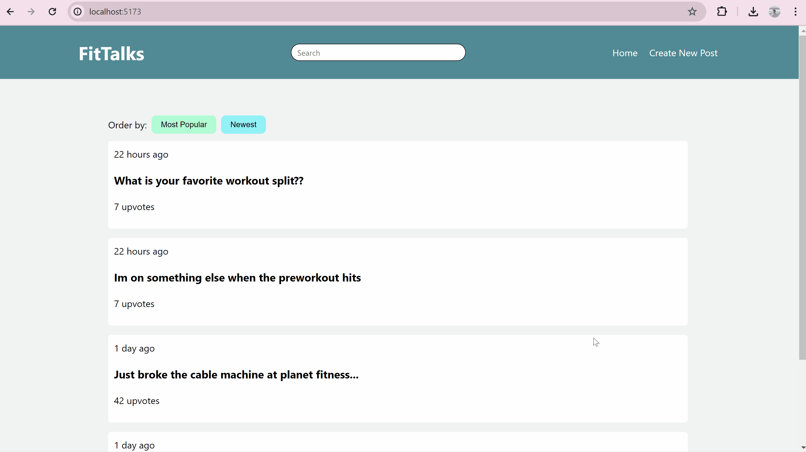

# Web Development Final Project - Fit Talks

## Check it out here! -> [Fit Talks](https://lumberger22.github.io/FitTalks/)

Submitted by: **Lucas Umberger**

**This web app: FitTalks is a fitness and wellness-focused online forum that enables users to create, edit, and interact with posts through likes and comments. It features content filtering by newest and popularity, a responsive design for accessibility across devices, and a search function to quickly find relevant topics. This platform is designed to foster a supportive community where enthusiasts can share insights and engage with each other's fitness journeys.**

 - Languages: JavaScript, HTML, CSS
 - Framework: React
 - Backend/API: Supabase

Time spent: **8** hours spent in total

## Required Features

The following **required** functionality is completed:

- [x] **A create form that allows the user to create posts**
- [x] **Posts have a title and optionally additional textual content and/or an image added as an external image URL**
- [x] **A home feed displaying previously created posts**
- [x] **By default, the time created, title, and number of upvotes for each post is shown on the feed**
- [x] **Clicking on a post shall direct the user to a new page for the selected post**
- [x] **Users can sort posts by either their created time or upvotes count**
- [x] **Users can search for posts by title**
- [x] **A separate post page for each created post, where any additional information is shown is linked whenever a user clicks a post**
- [x] **Users can leave comments underneath a post on the post's separate page**
- [x] **Each post should have an upvote button on the post's page. Each click increases its upvotes count by one and users can upvote any number of times**
- [x] **A previously created post can be edited or deleted from its post page**

## Video Walkthrough

Here's a walkthrough of implemented user stories:

GIF created with ScreenToGif

## Notes

- The main challenge I had here was trying to figure out the storing and fetching of data from supabase. I had originally fetched just by id to match the id of the link params, but that ended up not working for when I had other filters being used in the fetch. I then moved to using the .order filter to filter based on the date or time created, which were passed in as props to the fetch function. Then after incorperating the search bar to filter by title, I added another filter, .ilike, to make the string that was being searched.

## License

    Copyright [yyyy] [name of copyright owner]

    Licensed under the Apache License, Version 2.0 (the "License");
    you may not use this file except in compliance with the License.
    You may obtain a copy of the License at

        http://www.apache.org/licenses/LICENSE-2.0

    Unless required by applicable law or agreed to in writing, software
    distributed under the License is distributed on an "AS IS" BASIS,
    WITHOUT WARRANTIES OR CONDITIONS OF ANY KIND, either express or implied.
    See the License for the specific language governing permissions and
    limitations under the License.
